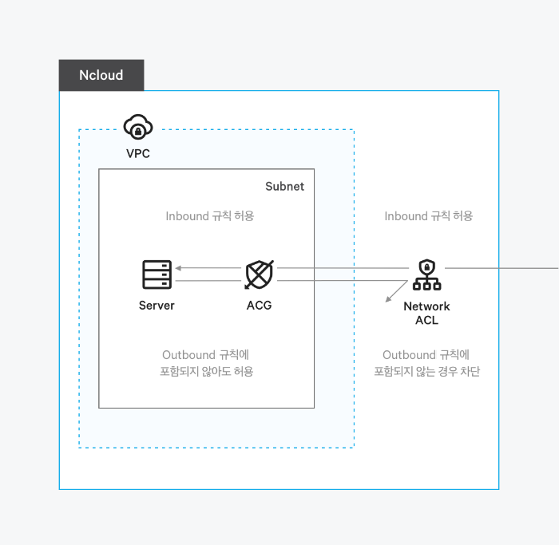
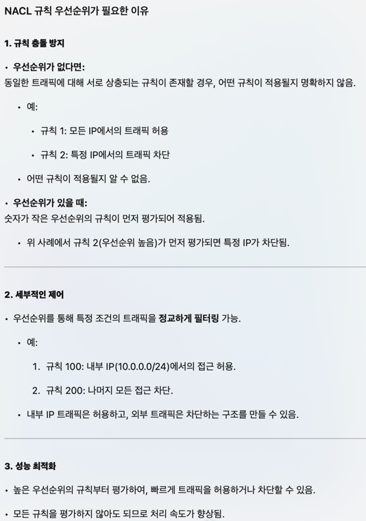

# Network ACL과 ACG

네이버 클라우드에서는 VPC의 보안 강화를 위해 Network ACL과 ACG 기능을 제공한다.
VPC 내부 Subnet에 접근하기 전 Network ACL에서 1차로 제어하고
서브넷 내의 서버에 접근하기 전 ACG에서 2차 제어를 진행한다.

라고 1차적으로 이해를 했다. 상세한 내용을 알아보자.

## NACL, ACG가 적용된 시스템의 구조
사진으로 보자.

아직은 잘 모르겠다.

문서를 보자.

## 규칙의 차이
- NACL은 허용, 차단 규칙을 설정하고, 기본적으로 허용 규칙을 적용 -> 기본적으로 모든 사람이 클럽에 들어갈 수 있고, 이상한(?) 사람을 가드가 차단하는 것과 같다.
- ACG는 허용 규칙을 설정하고, 기본적으로 차단 규칙을 적용 -> 기본적으로 모든 차량이 차단되고, 등록된 차량이 주차장에 들어가는 것과 같다.

비유가 이상하지만 이렇게 외우는 게 외우기 편했다.

## State의 차이
- NACL은 Stateless 방식으로 Inbound 규칙과 Outbound 규칙 별도 설정 필요 -> 수신된 주소로 다시 송신한다 해도 검사가 필요하다.
- ACG는 Stateful 방식으로 Inboud 규칙에서 허용되는 트래픽은 Outbound에서 자동 허용 -> 수신된 주소로 다시 송신할 때는 별도의 검사가 필요없다.

## 우선순위의 차이
- NACL은 규칙을 우선순위로 처리한다.
- ACG는 트래픽 허용 여부 결정 전 모든 규칙을 평가한다.

우선순위가 왜 필요한지 잘 모르겠다.

챗GPT가 그렇다고 한다.

글을 읽어보니 납득이 간다. 정리하자면,
1. NACL은 허용과 차단을 모두 설정할 수 있기 때문에 상충되는 규칙이 존재할 경우 우선순위가 더 높은 것이 적용된다.
2. 1번 항목을 이용해 일부 허용 우선순위를 전체 차단 우선순위보다 높게 설정하여 전체 차단 중 일부를 허용하는 보안 설정이 가능하다.
3. 우선순위 내에서 허용되거나 차단되는 경우 그 이하의 우선순위 규칙은 검사하지 않아도 돼 성능이 좋아진다.

## 적용범위의 차이
- NACL은 대상 Subnet 내 모든 서버에 적용
- ACG는 서버 시작 시 보안 그룹을 지정하거나 나중에 보안 그룹을 인스턴스와 연결할 때만 적용

위 개념은 맨 위에 첨부했던 그림을 보면 이해가 된다.

## 표로 정리

아래는 Network ACL과 ACG의 차이를 표로 정리한 것이다.

|Network ACL|ACG|
|------|---|
|Subnet 접근 시 작동|서버 접근 시 작동|
|Inbound/Outbound 트래픽의 허용 규칙, 차단 규칙 모두 설정 기본적으로 허용 규칙 적용|Inbound/Outbound 트래픽의 허용 규칙만 설정 기본적으로 차단 규칙 적용|
|Stateless 방식 - 트래픽 상태를 저장하지 않아 Inbound 규칙과 Outbound 규칙 별도 설정 필요|Stateful 방식 - 트래픽 상태를 저장해 Inbound 규칙에서 허용되는 트래픽은 Outbound 자동 허용|
|트래픽 허용 여부 결정 시 규칙을 우선순위로 처리| 트래픽 허용 여부 결정 전 모든 규칙을 평가|
|대상 Subnet 내 모든 서버에 적용(ACG를 지정하는 사용자에게 의존할 필요 없음)|서버 시작 시 보안 그룹을 지정하거나 나중에 보안 그룹을 인스턴스와 연결할 때만 적용|

전체적으로 NACL과 ACG가 서로의 취약점을 상호 보완하며 보안을 제어하는 것을 알 수 있다.

